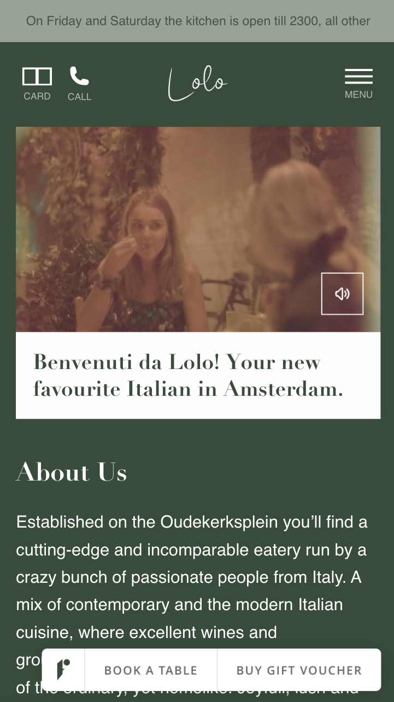
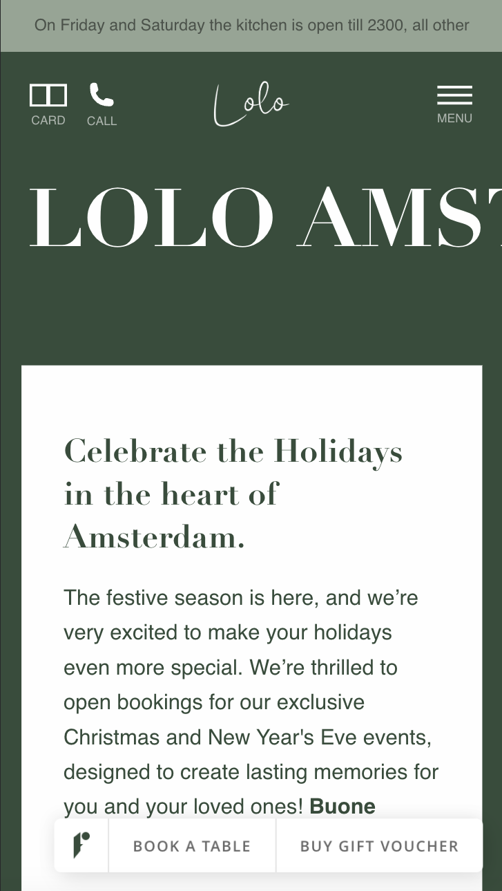
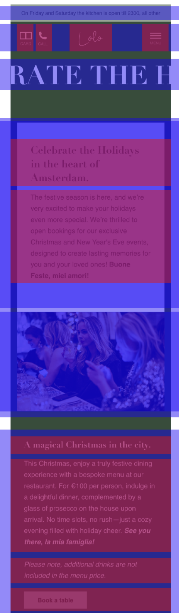
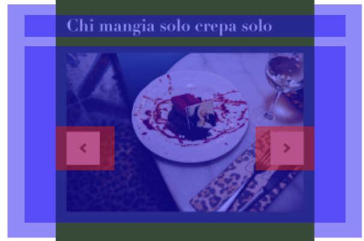
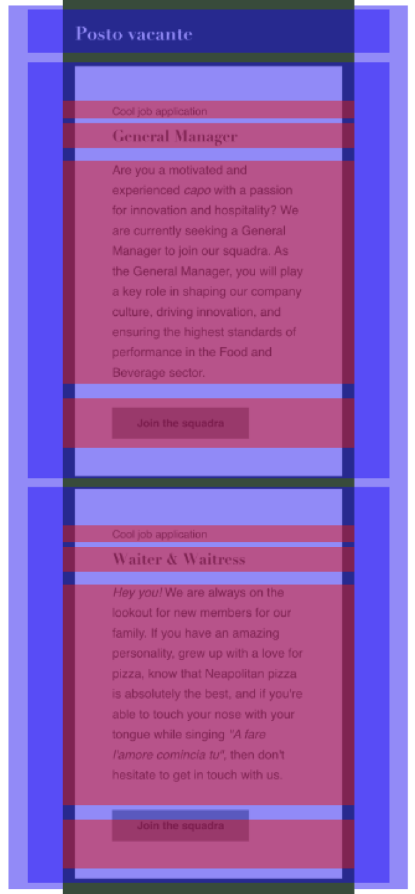
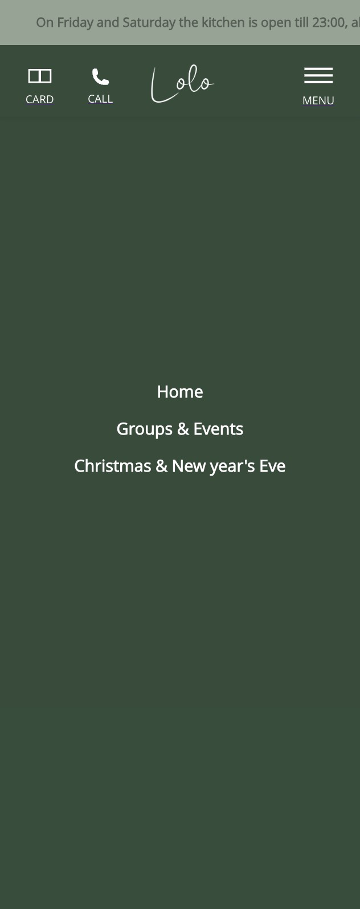

# Procesverslag
Markdown is een simpele manier om HTML te schrijven.  
Markdown cheat cheet: [Hulp bij het schrijven van Markdown](https://github.com/adam-p/markdown-here/wiki/Markdown-Cheatsheet).

Nb. De standaardstructuur en de spartaanse opmaak van de README.md zijn helemaal prima. Het gaat om de inhoud van je procesverslag. Besteedt de tijd voor pracht en praal aan je website.

Nb. Door *open* toe te voegen aan een *details* element kun je deze standaard open zetten. Fijn om dat steeds voor de relevante stuk(ken) te doen.

## Jij

  
uitwerken voor kick-off werkgroep

  ### Auteur:
  Venitsha Lieverse

  #### Je startniveau:
   Blauw

  #### Je focus:
  surface plane
  - Animaties (loading, nadruk, feedback, branding...)
  - preferce-reduced-motion
  - States van controls++ (forms, inputs, links...)
  - Custom properties (meer dan alleen kleur)
  - Svg stylen en animeren
 

## Je website

  
uitwerken voor kick-off werkgroep

  ### Je opdracht:
  https://lolo.amsterdam 

  #### Screenshot(s) van de eerste pagina (small screen): 
  hier de naam van de pagina  
  

  #### Screenshot(s) van de tweede pagina (small screen):
  hier de naam van de pagina  
  
 

## Toegankelijkheidstest 1/2 (week 1)

  
uitwerken na test in 2e werkgroep

  ### Bevindingen
 De site is goed te gebruiken met de voiceover functie. 
 Alle koppen en linkjes werden in de juiste volgorde opgelezen. 
 Ik heb geen fouten of problemen gevonden tijdens het doornemen van de website.

## Breakdownschets (week 1)

  
uitwerken na afloop 3e werkgroep

  ### de hele pagina: 
  

  ### dynamisch deel (bijv menu): 
  

  ### wellicht nog een dynamisch deel (bijv filter): 
  

## Voortgang 1 (week 2)

  
uitwerken voor 1e voortgang

  ### Stand van zaken
  De html van de pagina overnemen ging goed.
  Nog niet begonnen met css

  ### Agenda voor meeting
  samen met je groepje opstellen

  | student 1      | student 2          | student 3    | student 4        |
  | ---            | ---                | ---          | ---              |
  | dit bespreken  | en dit             | en ik dit    | en dan ik dat    |
  | en dat ook nog | dit als er tijd is | nog een punt | dit wil ik zeker |
  | ...            | ...                | ...          | ...              |

  ### Verslag van meeting
  hier na afloop snel de uitkomsten van de meeting vastleggen

  - Fonts staan juist in mijn code.
  - Bepaalde buttons moeten linkjes worden.
  - Main tag moet er nog in.
  - Scroll-snapping en flexbox gebruiken om een carousel te maken. De arrows met flexbox.
  - De juiste volgorde van de html aanhouden zodat de screenreader in de goede volgorde leest. Later met flexbox de juiste positie instellen.
  - De text in de header is wat slecht te lezen, dit kan een goeie verbeter punt zijn.

## Voortgang 2 (week 3)

  
uitwerken voor 2e voortgang

  ### Stand van zaken
  Begin van de css gaat goed, gebruik van de :root gaat
  ook goed. Ik weet niet zo goed hoe ik mijn html moet positioneren.

  ### Agenda voor meeting
  samen met je groepje opstellen

  | student 1      | student 2          | student 3    | student 4        |
  | ---            | ---                | ---          | ---              |
  | dit bespreken  | en dit             | en ik dit    | en dan ik dat    |
  | en dat ook nog | dit als er tijd is | nog een punt | dit wil ik zeker |
  | ...            | ...                | ...          | ...              |

  ### Verslag van meeting
  hier na afloop snel de uitkomsten van de meeting vastleggen

  - Beter gebruik maken van padding ipv width en centreren.
  - Met padding de tekst juist positioneren. 
  - Sections gebruiken mag.

## Toegankelijkheidstest 2/2 (week 4)

  
uitwerken na test in 9e werkgroep

  ### Bevindingen
  - De echte website gebruikt alleen een lsi voor de menu pagina. Ik heb nu ook de juiste lists toegevoegd in de header, footer en waar nodig.
  - De video op de homepage staat standaard op autoplay op de echte site. Ik heb hem gepauseerd als je op de pagina komt en hij loopt automatisch als je hem aan hebt gezet.
  - Het contrast van de tekst in de footer op de echte site had een behoorlijk lage cijfer. Ik heb het op mijn eigen site een hoger contrast gegeven.

## Voortgang 3 (week 4)

  
uitwerken voor 3e voortgang

  ### Stand van zaken
  Ik ben tevreden met wat ik op het moment heb. Ik heb bijna alle css gehad voor de basis opdracht. Ik weet alleen niet hoe ik de h1 moet animeren op mijn 2e pagina.
  Ik weet ook nog niet zo goed wat ik precies kwa surface plane wil gaan doen.

  ### Agenda voor meeting
  samen met je groepje opstellen

  | student 1      | student 2          | student 3    | student 4        |
  | ---            | ---                | ---          | ---              |
  | dit bespreken  | en dit             | en ik dit    | en dan ik dat    |
  | en dat ook nog | dit als er tijd is | nog een punt | dit wil ik zeker |
  | ...            | ...                | ...          | ...              |

  ### Verslag van meeting
  - Ik hulp gekregen met wat ik kan gebruiken voor de animatie van de h1. Ik kan daarvoor marquee gebruiken.
  - Ik ga voor de wat simpelere opties die te kiezen zijn voor de surface plane opdrachten.

## Eindgesprek (week 5)

  
uitwerken voor eindgesprek

  ### Je uitkomst - karakteristiek screenshots:
  

  ### Dit ging goed/Heb ik geleerd: 
  
  Ik heb geleerd hoe je met css het zelfde effect krijgt als met de marquee tag in html.

  

  ### Dit was lastig/Is niet gelukt:

 Ik had enorm veel moeite met het menu juist te krijgen en he heb uiteindelijk toch wel wat van een menu maar niet juist.

  

## Bronnenlijst

  
continu bijhouden terwijl je werkt

  Nb. Wees specifiek ('css-tricks' als bron is bijv. niet specifiek genoeg). 
  Nb. ChatGpT en andere AI horen er ook bij.
  Nb. Vermeld de bronnen ook in je code.

  1. De code voor de silder op de home page(ik heb er ook javascript bij gebruikt om wat puntjes op de i te zetten alleen kan ik de chat niet terug vinden omdat ik niet ingelogd was)java & css: https://www.w3schools.com/howto/howto_js_slideshow.asp
  2. Om de video op de home page te kunnen pauseren en te muten heb ik gebruik gemaakt van de volgende bronnen: https://www.w3schools.com/tags/att_video_muted.asp
	https://www.w3schools.com/tags/att_video_loop.asp 
  3. Om de h1 op mijn 2e pagina te laten werken maar dan zonder de marquee atribute heb ik de volgende bron gebruikt(Ik heb m ook gebruikt om boven in de note te laten bewegen zodat alles te lezen is. Dit was niet mogelijk bij de originele website): https://medium.com/@attarfarnoosh/an-animated-moving-text-effect-with-toy-story-characters-a8692e887042 

